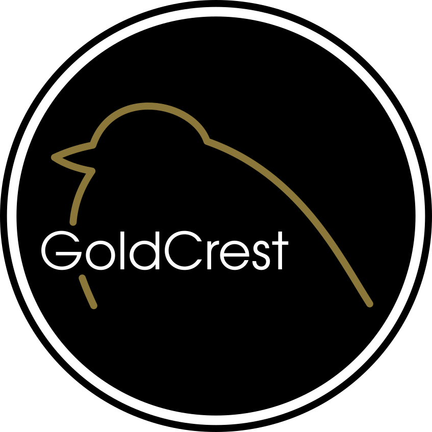

# GoldCrest

A lightweight open source 3D game engine written in C++ 17.

## What it does and what it doesn't
The project aims to provide a game engine along with abstraction layers
between libraries and user's application. It includes several libraries along with tools to easily
add others. It aims to be extendable, modular and reusable. Big emphasis is put on good documentation
and testing of the features.

It doesn't provide an editor like unity, the project is used as a library.

## Gallery
_Coming soon_

## Goals
The goals of GoldCrest are:
- Portability
- Extensibility
- Ease of use

In no particular order.

## Cloning the repository
To clone the repository issue the following command:

```git clone --recursive https://github.com/msperkow/goldcrest.git```

## Compiling
GoldCrest is built using cmake, you can obviously build
it in other ways, but only cmake is supported by the project.

To compile simply

## How to use
You can use the repo as a git submodule or download
the compiled library.

To use the engine as a submodule in your project run the following command
from the folder you wish to init submodule in:

```git submodule add https://github.com/msperkow/goldcrest.git```

And remember to include the goldcrest directory in your cmakelists.

_Coming soon_

## Contributing
If you want to contribute, great!

Before you do, please look through the guidelines in doc/guidelines.
For an instruction on how to contribute refer to the [workflow guideline](doc/guidelines/workflow.md).

## License
GoldCrest is licensed under MIT license, details in the LICENSE file.

## Contact
- Owner: msperkow
- Website: _Coming soon_
